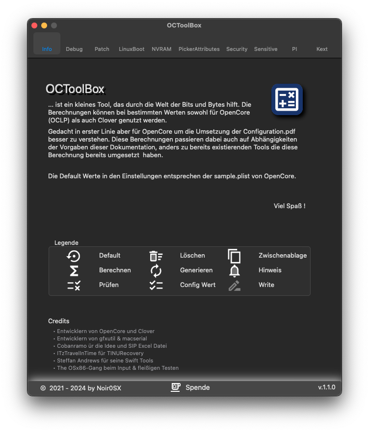

# OCToolBox - Calculate Tool for OpenCore

# Supported
### 
###   

# Next Beta v0.8.6
| Menü | | | |
| ------------------- | --------------------------------- | --------------------------------- | --------------------------------- |
| SMBios | | | | |
| Security | Scan Policy |  OpenCore Menu Password | Vault |
| Expose Sensitive Data |  | | | |
| Picker Attributes |  | | | |
| Target | | | | |
| SIP | | | | |
| OpenLinuxBoot | | | | |
| Device | Audio| Grafik | |

#
### Credits
* [Entwicklern von OpenCore](https://github.com/acidanthera) & [Clover](https://github.com/CloverHackyColor/CloverBootloader)
* [Entwicklern von gfxutil](https://github.com/acidanthera/gfxutil)
* [Entwicklern von macserial](https://github.com/acidanthera/OpenCorePkg/tree/master/Utilities/macserial)
* Cobanramo Hackintosh-Forum für die Idee und Excel Datei
* The OSx86-Gang beim Input & fleißigen Testen
